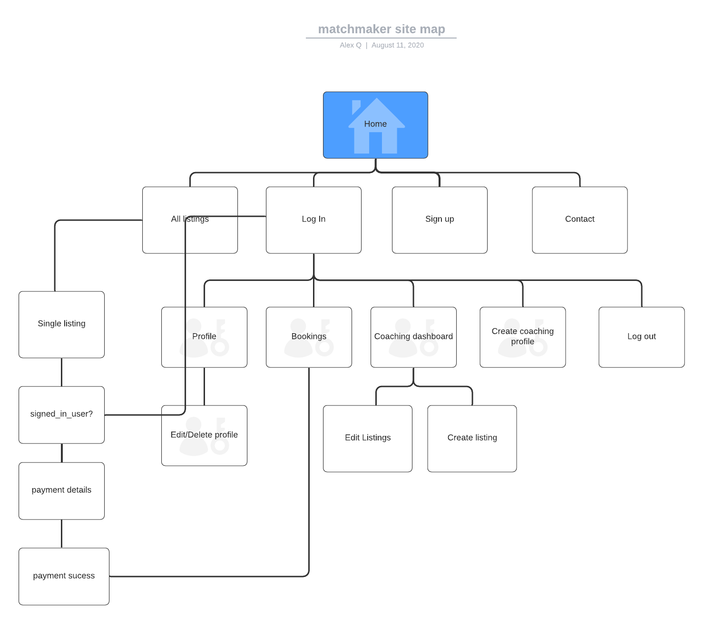
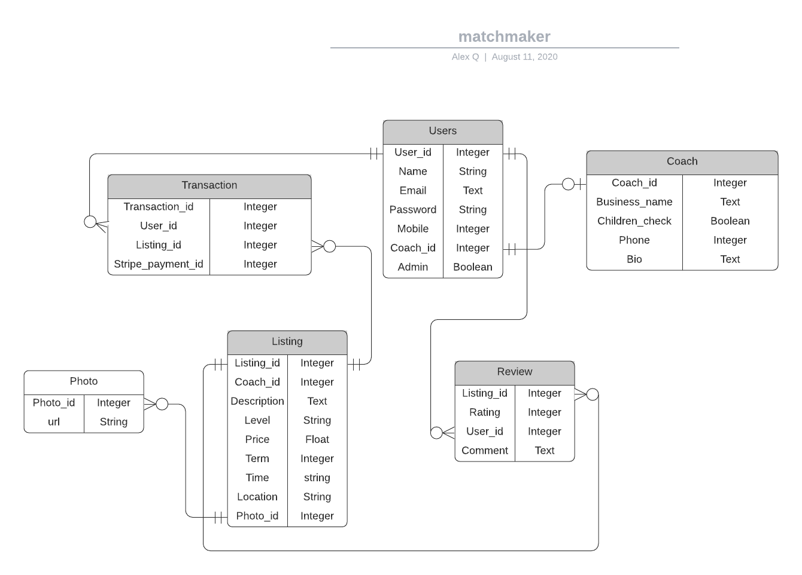

# Matchmaker

https://github.com/AlexQ6/Matchmaker
https://mysterious-refuge-14245.herokuapp.com/

Match maker is an Australian based online platform which eases the the process of finding coaching for tennis players. With its simple ui and intuitiveness, coaching clinics, academies and independents has a brand new avenue to expand their business operations.

## Problem

Tennis coaching has always been done through tennis clubs, whether that's through internal programs or establishing a relationship with a external coaching clinic. For a player, that has been an extra hoop to go through to find someone who can improve your skills. In addition booking a session with a coach can be a hassle via phone or through an outdated online system.  

This problem needs to be solved as tennis continues to be a growing sport within Australia and worldwide, tennis coaching must keep with the technology of the modern day. Ease of access to coaching is crucial to improving the standards of play and promoting the sport. Matchmaker seeks to be that platform that houses all your coaching needs under one roof.

## Target audience

Tennis players of all levels capabilities who are looking for a professional/organisation to take their game to the next level. For coaches/organisation, this is a easy to use platform that includes a community of users passionate about tennis and seeks to improve.

## Tech stack

- html.erb
- Ruby
- Ruby on Rails
- PostgreSQL
- Heroku
- Amazon S3
- Github
- VScode (Text editor)
- Trello (Task tracking)
- Balsamiq(Wireframes creation)
- Lucidchart(ERD creation )

## Sitemap


## Functionality and features

**Accounts:** Users can create accounts to access the full site and must be logged in to make any purchases or advertise services. The general public can have access the home, about, help pages but are restricted from making transactions. User accounts have the option be purchase coaching and if they are a coach, enter additional info to sale services.

**Listings:** All users can register in order to verify coaching status. Logged in coaches can see who has purchased their services and hide the listing once their capacity for students have filled.


### future functionality

**Messaging:** Users can message potential coaches to discuss details about their methods and organise location once payments has been processed.

**Search and Filter:** Users can search for coaches by area, review rating and price to match their needs.

**Payment:** Upon payment stage users will select a block of time the coach has made available before entering payment details. Confirmation page will show once payment has been processed by Stripe API

**Review/comment section:** Users are able to leave reviews and ratings on coaches for feedback and let other users know about a particular coach.

## wireframes

|  |  |  |  |
|  |  |  |  |

## User Stories

### User management

- As site visitor I want to be able to
  - sign up to order services or sell my services as a coach

- As a logged in user I want to be able to 
  - log into the app via email and password
  - Log out of the app
  - delete my account from the website
  - edit my profile 
  - add a coaching profile

### Listings
- As site visitor I want to be able to
  - see what coaches are advertising their services without logging in
  - search and filter for listings with regards to price, area and review rating
  
- As a logged in coach I want to be able to
  - create a listing of my coaching program (eg Tuesday 2pm for 10 weeks)
  - upload pictures and information about my coaching program
  - save incomplete listing as drafts
  - publish/unpublish a listing
  - edit and delete a listing
  - view my current listing

### Bookings

- As a logged in user I want to be able to
  - purchase a coaching program
  - Enter financial details for payment
  - See booking confirmation on site and (via email?)
  - see purchase history

- As a logged in coach I want to be able to
  - sell my coaching program
  - see a list of people who have purchased my program

### Authentication & Authorisation

- As a logged in user 
  - I don't want anyone else have access to my account information
  - I cant comment on my own listing

- As a logged in coach 
  - I should not have the option to buy my own coaching program
  - I cant comment on my own listing
  - I don't want others to be able to edit or delete my listing


## High-level components 

- User
  - Users are tennis players looking to find coaching sessions to book. Users are able to book coaching session listings. In future iterations of the app, they can comment on booked sessions as well after purchase. Without logging in, users can still view all listings that are available. 
- Coaches
  - Existing users who are tennis coaches can apply to be a coach in order to be able to post coaching session listings. Coaches can see create, edit and view their own listings. In future coaches can see users who have purchased their sessions. 
- Listing
  - Coaching session listings are the key items of value being traded on this app. Information about the listing like price, description, location and others are provided by the coach who created the listing. 


## Third party services

- Amazon S3
  - The Amazon S3 service provides a cloud storage solution for static files and images. In case of this app, it is used to store pictures of listings and user profile pictures. Working together with the Active storage module within rails, it allows the app lighten its load.

## Model relations

A user has a dependent coach, without user there is no coach and coach belongs to user

A user has_one_attached picture, a picture belongs_to a user.

A coach has_many listings, a listing belongs_to a coach.

A listing belongs_to a coach, a coach has_many listings.

A listing has_one_attached picture, a picture belongs_to a listing.


```
class User < ApplicationRecord
  rolify
  # Include default devise modules. Others available are:
  # :confirmable, :lockable, :timeoutable, :trackable and :omniauthable
  devise :database_authenticatable, :registerable,
         :recoverable, :rememberable, :validatable

  has_one_attached :picture
  has_one :coach, dependent: :destroy
  
end


class Coach < ApplicationRecord
  has_many :listings
  belongs_to :user

end

class Listing < ApplicationRecord
  belongs_to :coach
  has_one_attached :picture
end


```

### future app versions

A Listing has_many reviews, a review belongs_to a user.

A listing has_many transactions, a transaction belongs_to a listing.

## Database relations

### Planning ERD


### final ERD


- Users table
  - User has three relations with other tables. A one to one relationship with coach, a one to many relationship with review, a one to many relationship with transactions and a one to one relationship with photos

- Coaches table
  - Has a one to one relationship with user and includes user_id as a foreign key. Also has a one to many relationship with listings.

- Listings table
  - Has a one to many relationship with coaches and contain a coach_id as foreign key and a one to many relationship with photos 

## Database schema design

```
ActiveRecord::Schema.define(version: 2020_08_11_005033) do

  # These are extensions that must be enabled in order to support this database
  enable_extension "plpgsql"

  create_table "active_storage_attachments", force: :cascade do |t|
    t.string "name", null: false
    t.string "record_type", null: false
    t.bigint "record_id", null: false
    t.bigint "blob_id", null: false
    t.datetime "created_at", null: false
    t.index ["blob_id"], name: "index_active_storage_attachments_on_blob_id"
    t.index ["record_type", "record_id", "name", "blob_id"], name: "index_active_storage_attachments_uniqueness", unique: true
  end

  create_table "active_storage_blobs", force: :cascade do |t|
    t.string "key", null: false
    t.string "filename", null: false
    t.string "content_type"
    t.text "metadata"
    t.bigint "byte_size", null: false
    t.string "checksum", null: false
    t.datetime "created_at", null: false
    t.index ["key"], name: "index_active_storage_blobs_on_key", unique: true
  end

  create_table "coaches", force: :cascade do |t|
    t.string "business_name"
    t.boolean "children_check"
    t.integer "business_mobile"
    t.text "bio"
    t.datetime "created_at", precision: 6, null: false
    t.datetime "updated_at", precision: 6, null: false
    t.bigint "user_id"
    t.index ["user_id"], name: "index_coaches_on_user_id"
  end

  create_table "listings", force: :cascade do |t|
    t.text "description"
    t.integer "level"
    t.float "price"
    t.integer "term"
    t.string "time"
    t.string "location"
    t.bigint "coach_id", null: false
    t.datetime "created_at", precision: 6, null: false
    t.datetime "updated_at", precision: 6, null: false
    t.string "title"
    t.string "picture"
    t.index ["coach_id"], name: "index_listings_on_coach_id"
  end

  create_table "roles", force: :cascade do |t|
    t.string "name"
    t.string "resource_type"
    t.bigint "resource_id"
    t.datetime "created_at", precision: 6, null: false
    t.datetime "updated_at", precision: 6, null: false
    t.index ["name", "resource_type", "resource_id"], name: "index_roles_on_name_and_resource_type_and_resource_id"
    t.index ["resource_type", "resource_id"], name: "index_roles_on_resource_type_and_resource_id"
  end

  create_table "users", force: :cascade do |t|
    t.string "email", default: "", null: false
    t.string "encrypted_password", default: "", null: false
    t.string "reset_password_token"
    t.datetime "reset_password_sent_at"
    t.datetime "remember_created_at"
    t.datetime "created_at", precision: 6, null: false
    t.datetime "updated_at", precision: 6, null: false
    t.string "picture"
    t.index ["email"], name: "index_users_on_email", unique: true
    t.index ["reset_password_token"], name: "index_users_on_reset_password_token", unique: true
  end

  create_table "users_roles", id: false, force: :cascade do |t|
    t.bigint "user_id"
    t.bigint "role_id"
    t.index ["role_id"], name: "index_users_roles_on_role_id"
    t.index ["user_id", "role_id"], name: "index_users_roles_on_user_id_and_role_id"
    t.index ["user_id"], name: "index_users_roles_on_user_id"
  end

  add_foreign_key "active_storage_attachments", "active_storage_blobs", column: "blob_id"
  add_foreign_key "coaches", "users"
  add_foreign_key "listings", "coaches"
end

```

## Task allocation and tracking
[Trello Link](https://trello.com/b/0cEtyTCR/matchmaker)

The project was broken up, allocated and tracked via the website Trello. Trello allows the user put tasks into cards. By loosely following a agile methodology, the tasks are sorted into five major categories to do, doing, done, planning and functions. To do, doing, done was the main tracking element of the project, to properly prioritise tasks. Planning category is where the project's planning tasks were broken down and functions categories were app functionality pieces to be done.

## Testing

Manual testing was used 

| Feature | Description | Expected Outcome | Actual Outcome | Sidenote |
| ------ | ------ | ------- | ------- | ------ |
| Testing heroku connection | Y |
| Create user | A new user is added to the database | New entry is generated in user database| Y | 
| User sign in  | An existing user signs into app | sign in confirmation appears and directed to dashboard| Y |
| profile restriction | Site visitor is prohibited from seeing a user dashboard | site visitor is redirected to log in if user routes is entered|  | None 
| Coach restriction | User cannot see coach features until user applys as a coach | site visitor is redirected to coach sign up page|  | None 
| Edit and delete user profile (includes change password) | Y |
| Image upload | Users can upload images when creating a new listing | Image exists in Amazon s3 bucket and available for viewing on website | Y |